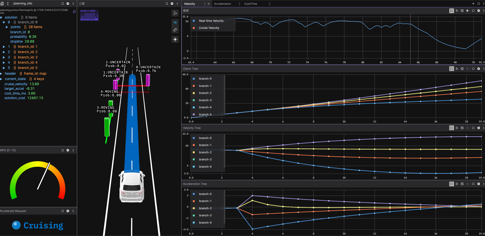
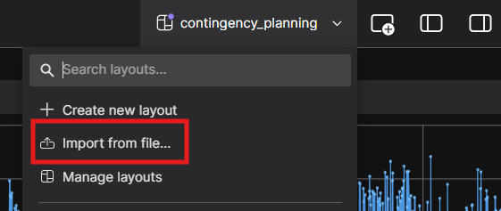

# Dive-into-Contingency-Planning


This repository implements contingency planning for adaptive cruise control in pedestrian crossing scenario. This algorithm makes delayed decisions through the shared segments of the tree model to balance risk and efficiency,  for more information, see [Contingency Planning防御性规划实践](https://zhuanlan.zhihu.com/p/1952784288438293473).

<p align="center">
  
</p>


## 1. Prerequisites

- **Dependencies:** [spdlog](https://github.com/gabime/spdlog), [yaml-cpp](https://github.com/jbeder/yaml-cpp), [protobuf](https://github.com/protocolbuffers/protobuf), [eigen]( http://eigen.tuxfamily.org/), [osqp](https://github.com/osqp/osqp)(v0.6.2), [osqp-eigen](https://github.com/robotology/osqp-eigen), [open-blas]()
- **Visualization:** Download [foxglove studio](https://foxglove.dev/download) to local, or use the [web application](app.foxglove.dev) in a browser
- Tested on WSL2 Ubuntu 20.04🐧


## 2. Build

Clone the repository and make:

```
git clone https://github.com/PuYuuu/dive-into-contingency-planning.git
cd dive-into-contingency-planning
cmake -B build
cmake --build build -- -j6
```


## 3. Execute examples

 If you run it for the first time, import the layout file [control_tree_layout.json](./assets/control_tree_layout.json).

<p align="center">
  
</p>

Next, open foxglove websocket and wait for the data. For more information on the usage of foxglove, please refer to the official documentation [Foxglove Documentation](https://docs.foxglove.dev/docs).

<p align="center">
  
</p>

To start the simulation, execute the following command in the terminal. If there are no unexpected circumstances, the data and scenes in foxglove will keep refreshing.

```shell
./build/planning_node -c ./assets/default.yaml
```

Modify `default.yaml` to set your scenario:

```yaml
max_driving_distance: 10000.0 # meters
max_simulation_time: 300.0    # seconds

planning:
  steps_per_phase: 4
  n_branches: 6
  desired_speed: 13.89  # 50 km/h
  u_max: 2.0
  u_min: -6.0
  log_level: "info"     # options: trace, debug, info, warn, err, critical, off
  solver_type: "osqp"   # options: osqp, control_tree_solver

simulator:
  n_pedestrians: 5
  p_crossing: 0.05
  lane_width: 3.5
  init_speed: 10.0
  log_level: "debug"
  save_mcap: false
```


## Acknowledgements

This repository is developed based on **Control-Tree Optimization**, for details, please refer to the paper:

> Phiquepal, Camille, and Marc Toussaint. "Control-Tree Optimization: an approach to MPC under discrete Partial Observability." *2021 IEEE International Conference on Robotics and Automation (ICRA)*. IEEE, 2021.

Original version of Control-Tree Optimization can be found in [Control Tree](https://github.com/ControlTrees/icra2021?tab=readme-ov-file)
